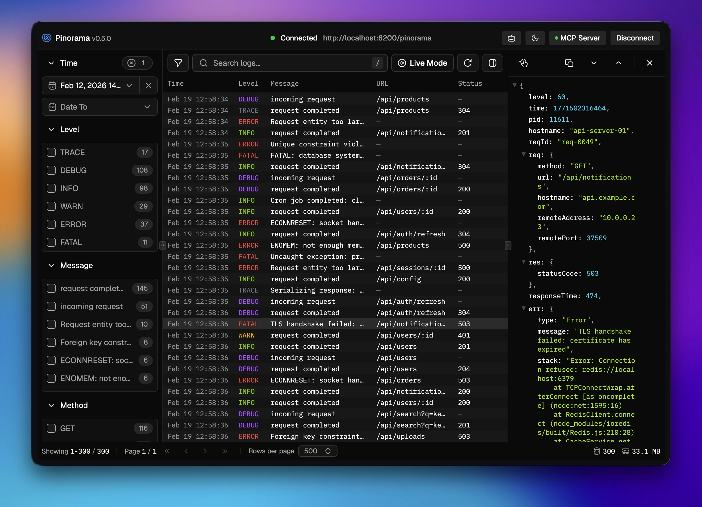

<p align="center">
  
</p>

<h1 align="center">Pinorama</h1>

<p align="center">
  <b>Explore your logs smarter and faster</b><br />
  A beautiful yet powerful Node.js log viewer
</p>

<p align="center">
  <a href="https://github.com/pinoramajs/pinorama/actions/workflows/turbo.yml"></a>
  <a href="https://pinorama.dev"></a>
  <a href="https://opensource.org/licenses/MIT"></a>
</p>

---

Pinorama is a suite of packages for storing, exploring, and analyzing [Pino](https://getpino.io) logs. Pipe logs from any Node.js process, search them instantly with [Orama](https://askorama.ai), and explore them in a real-time web UI.

<p align="center">
  
</p>

## Features

- **Full-text search** — Powered by Orama with faceted filtering
- **Real-time streaming** — Pipe logs and watch them appear instantly with Live Mode
- **MCP integration** — Connect AI assistants to query logs in natural language
- **Keyboard-first** — Navigate, filter, and inspect logs without touching the mouse
- **Custom styles** — Color-code log levels, HTTP methods, and any field
- **Fastify plugin** — Drop-in server with authentication, persistence, and auto-save
- **Presets** — Built-in schemas for Pino and Fastify logs, or create your own

## Quick Start

Install Pinorama Studio globally:

```sh
npm i -g pinorama-studio
```

Pipe logs from any Node.js application:

```sh
node app.js | pinorama --open
```

This starts an embedded server, ingests the piped logs, and opens the Studio UI in your browser.

## Packages

| Package | Description |
| --- | --- |
| [pinorama-studio](https://pinorama.dev/packages/studio) | Web UI and CLI for viewing, filtering, and analyzing logs |
| [pinorama-server](https://pinorama.dev/packages/server) | Fastify plugin with REST API, auth, persistence, and MCP |
| [pinorama-transport](https://pinorama.dev/packages/transport) | Pino transport that buffers and streams logs to the server |
| [pinorama-client](https://pinorama.dev/packages/client) | Isomorphic HTTP client for Node.js and the browser |
| [pinorama-mcp](https://pinorama.dev/packages/mcp) | Model Context Protocol server for AI-powered log analysis |
| [pinorama-presets](https://pinorama.dev/advanced/presets) | Schema and introspection configs for Pino and Fastify |

## How It Works

```
Pino Logger → Transport (buffers) → POST /bulk → Server (Orama) → Studio UI
                                                        ↕
                                                   MCP (AI assistants)
```

1. **Pino Logger** creates structured JSON logs
2. **Pinorama Transport** buffers and sends them in batches
3. **Pinorama Server** stores and indexes logs with Orama
4. **Pinorama Studio** displays logs with search, filters, and live refresh
5. **Pinorama MCP** connects AI assistants for natural-language queries

## Documentation

Full documentation is available at **[pinorama.dev](https://pinorama.dev)**.

## Contributing

Contributions are welcome! This is a monorepo using pnpm workspaces and Turborepo.

```sh
pnpm install   # install dependencies
pnpm build     # build all packages
pnpm test      # run all tests
pnpm dev       # start dev servers
```

## License

[MIT](LICENSE)
